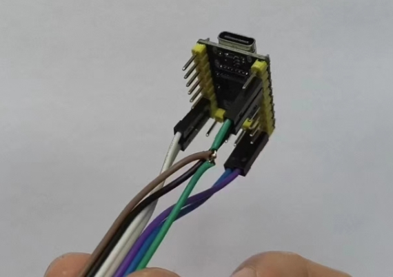
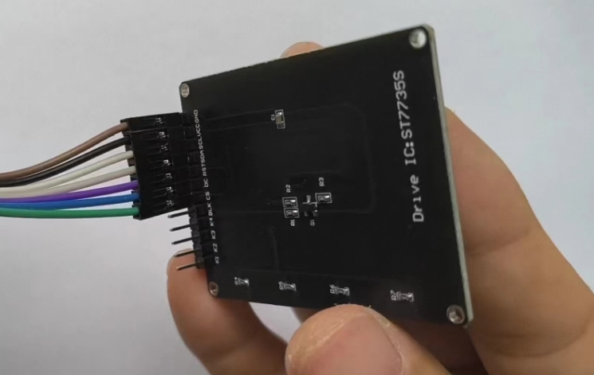
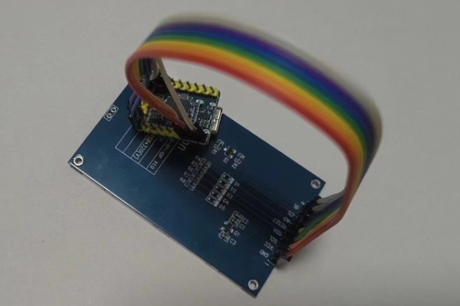

# USB Screen
 USB屏幕&编辑器

# 图文教程:

# [https://zhuanlan.zhihu.com/p/698789562](https://zhuanlan.zhihu.com/p/698789562)

# 视频教程
# [https://www.bilibili.com/video/BV1eTTwe6EFU/?vd_source=a2700de3db7bd5f0117df32bdd5cef9f](https://www.bilibili.com/video/BV1eTTwe6EFU/?vd_source=a2700de3db7bd5f0117df32bdd5cef9f)

# 硬件

## 支持的屏幕型号

目前支持 ST7735 128x160 和 ST7789 320x240两种屏幕

### ST7735接线方式
```
    GND <=> GND
    VCC <=> 3V3
    SCL <=> SCLK(GPIO6)
    SDA <=> MOSI(GPIO7)
    RES <=> RST(GPIO14)
    DC  <=> DC(GPIO13)
    CS  <=> GND
    BLK <=> 不连接
```



### ST7789接线方式
```
    GND   <=> GND
    VCC   <=> 3V3
    SCL   <=> PIN6(clk)
    SDA   <=> PIN7(mosi)
    RESET <=> PIN14(rst)
    AO    <=> PIN13
    CS    <=> PIN9
    BL    <=> 5V
```


### ST7789 240x240 接线方式
```
    GND   <=> GND
    VCC   <=> 3V3
    SCL   <=> PIN6(clk)
    SDA   <=> PIN7(mosi)
    RESET <=> PIN14(rst)
    DC    <=> PIN13
    CS    <=> PIN9
    BL    <=> 5V
```

## 固件源码
https://github.com/planet0104/rp2040_usb_screen

## 接线方式


# 编译

## 编译aarch64-linux

1、设置default features，启用 v4l-webcam

```toml
[features]
default = ["v4l-webcam", "usb-serial"]
```

2、启动 DockerDesktop

3、进入 wsl2 Ubuntu

4、安装 cross

```shell
cargo install cross --git https://github.com/cross-rs/cross
```

5、编译

注意 Cross.toml 中的配置

```shell
# rustup component add rust-src --toolchain nightly
RUSTFLAGS="-Zlocation-detail=none" cross +nightly build -Z build-std=std,panic_abort \
  -Z build-std-features=panic_immediate_abort \
  -Z build-std-features="optimize_for_size" \
  --target aarch64-unknown-linux-gnu --release
```

# 运行编辑器

## windows中运行

设置 deault features

```toml
[features]
default = ["editor", "tray", "nokhwa-webcam"]
```

```cmd
./run.cmd
```

## Ubuntu中运行

设置 deault features

```toml
[features]
default = ["editor", "v4l-webcam"]
```

```bash
# export https_proxy=http://192.168.1.25:6003;export http_proxy=http://192.168.1.25:6003;export all_proxy=socks5://192.168.1.25:6003
# export https_proxy=;export http_proxy=;export all_proxy=;
sudo apt-get install -y libclang-dev libv4l-dev libudev-dev

sh run.sh
# sudo ./target/debug/USB-Screen
# sudo ./target/debug/USB-Screen editor

## v4l utils
## sudo apt install v4l-utils
## v4l2-ctl  --list-formats -d /dev/video0
## v4l2-ctl --list-formats-ext -d /dev/video0
```

## 飞牛私有云 fnOS 编译

```bash
# 切换到root模式(登录 planet,root123)
sudo -i
# 首先安装rust
# ...
# 飞牛OS编译前需要升级libc6=2.36-9+deb12u9
sudo apt-get install aptitude
aptitude install libc6=2.36-9+deb12u9
apt install build-essential
#安装依赖库
apt install pkg-config
sudo apt-get install -y libclang-dev libv4l-dev libudev-dev
# 打开x86_64 linux编译特征
# ！！注意关闭 editor特征！！
# x86_64 linux
# default = ["v4l-webcam", "usb-serial"]
# 克隆然后编译
rm Cargo.lock
cargo build --release
```